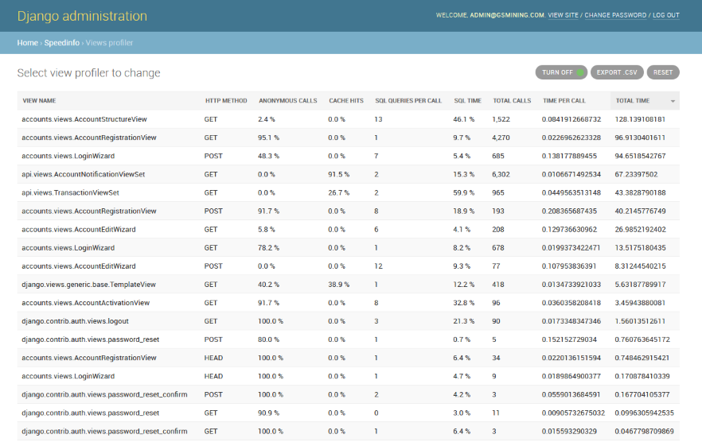

================
django-speedinfo
================

.. image:: https://travis-ci.org/catcombo/django-speedinfo.svg?branch=master
    :alt: Build Status
    :target: https://travis-ci.org/catcombo/django-speedinfo

SpeedInfo is a live profiling tool for the Django framework to find
most highload views in your project for the next optimization.
SpeedInfo counts number of calls, cache hits, SQL queries,
measures average and total call time and more for each of your views.
Detailed report and profiler controls are available in Django admin.

Production ready. Real projects tested.

Installation
============

1. Run ``pip install django-speedinfo``.
2. Add ``speedinfo`` to the beginning of the ``INSTALLED_APPS``.
3. Add ``speedinfo.middleware.ProfilerMiddleware`` to the end of ``MIDDLEWARE`` (or ``MIDDLEWARE_CLASSES`` for Django < 1.10) list, but before ``django.middleware.cache.FetchFromCacheMiddleware`` (if used)::

    MIDDLEWARE = [
        ...,
        'speedinfo.middleware.ProfilerMiddleware',
        'django.middleware.cache.FetchFromCacheMiddleware',
    ]

4. Run ``python manage.py migrate``.
5. Run ``python manage.py collectstatic``.
6. Setup any cache backend, except local-memory and dummy caching. Profiler uses the cache to store its state.

Usage
=====

Open ``Views profiler`` in Django admin. Click the ``Turn on`` / ``Turn off`` button
to control profiler state. Use ``Reset`` button to flush all data.

Configuration
=============

To exclude some urls from profiling add it to the ``SPEEDINFO_EXCLUDE_URLS`` list.
``SpeedInfo`` uses re.match internally to test requested url. Example::

    SPEEDINFO_EXCLUDE_URLS = [
        r'/admin/',
        r'/news/$',
        r'/movie/\d+/$',
    ]

``SpeedInfo`` automatically detects when using Django per-site caching via
``UpdateCacheMiddleware`` and ``FetchFromCacheMiddleware`` middlewares
or per-view caching via ``cache_page`` decorator and counts cache hit
when retrieving page from cache.

In case you implement your own caching logic and want to mark
view response as obtained from the cache, set attribute with name taken
from ``SPEEDINFO_CACHED_RESPONSE_ATTR_NAME`` to True to the ``HttpResponse`` object.
Example::

    from django.views import View
    from speedinfo.settings import SPEEDINFO_CACHED_RESPONSE_ATTR_NAME

    class CachedView(View):
        def get(self, request, *args, **kwargs):
            # ...
            # `response` was taken from the cache
            # mark it in appropriate way
            setattr(response, SPEEDINFO_CACHED_RESPONSE_ATTR_NAME, True)
            return response

Change ``SPEEDINFO_REPORT_COLUMNS`` settings to customize Django admin profiler columns.
Default value::

    SPEEDINFO_REPORT_COLUMNS = (
        'view_name', 'method', 'anon_calls_ratio', 'cache_hits_ratio',
        'sql_count_per_call', 'sql_time_ratio', 'total_calls', 'time_per_call', 'total_time'
    )
